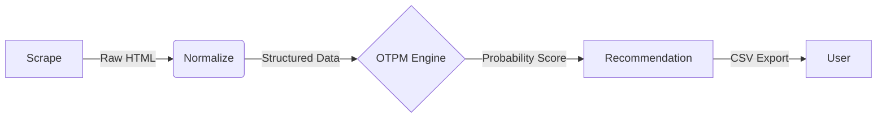

# OA Trigger Engine

> **A local-first intelligence engine for job seekers.**  
> Scrapes, normalizes, and analyzes job postings to estimate the probability of triggering an Online Assessment (OA).

## 🚀 Overview

**OA Trigger Engine** is a technical tool designed to reverse-engineer the "black box" of initial recruiter screening. By scraping job board data and applying ATS-like normalization rules, it helps candidates identify high-probability opportunities where they are likely to pass the automated screening filter.

It is built with **Privacy** and **Stealth** in mind, running entirely locally on your machine.

---

## 🏗️ Architecture

The system follows a standard ETL (Extract, Transform, Load) pipeline:



1.  **Scrape**: Headless browser (Playwright) collects job data from LinkedIn (public view).
2.  **Normalize**: Regex & Heuristics extract structured fields (Skills, Experience, Visa Status).
3.  **Analyze**: *[In Progress]* The OTPM (OA Trigger Probability Metric) calculates a score (0.0 - 1.0).
4.  **Export**: Clean, actionable data is saved to CSV for manual review.

---

## ✨ Key Features

### 🔍 Batch Search & Filtering
- **Deep Search**: Scrapes hundreds of jobs based on keywords (e.g., "Software Engineer") and location.
- **Advanced Filters**: Supports **"Past 24 Hours"**, **"Entry Level"**, and other LinkedIn filters via URL parameters.
- **Scalable**: Dynamic scrolling logic handles pagination to fetch as many jobs as requested.

### 🛡️ Stealth & Robustness
- **Anti-Ban Architecture**:
    - **User-Agent Rotation**: Mimics different devices/browsers for every session.
    - **Jitter**: Introduces random, human-like delays (2-5s) between actions.
    - **Fail-Fast**: Aggressive timeouts (15s) prevent the scraper from hanging on broken pages.

### 🧠 Intelligent Normalization
- **Skill Extraction**: Matches against a curated dictionary of tech stack keywords (Python, React, Ansible, Terraform, etc.).
- **Experience Parsing**: regex-based extraction of years of experience (e.g., "3+ years", "5-7 years").
- **Visa Signal Detection**: Scans for positive ("sponsorship") and negative ("US Citizen only") keywords.
- **Repost Detection**: Identifying "Reposted" jobs vs "Fresh" opportunities.

---

## 🛠️ Tech Stack

- **Language**: Python 3.12+
- **Browser Automation**: Playwright
- **Data Modeling**: Pydantic
- **Parsing**: Regex + Heuristics
- **Output**: CSV

---

## 📦 Installation

1.  **Clone the repository**:
    ```bash
    git clone https://github.com/Hrishank07/OA_Trigger_Engine.git
    cd OA_Trigger_Engine
    ```

2.  **Create a virtual environment**:
    ```bash
    python -m venv venv
    source venv/bin/activate  # On Windows: venv\Scripts\activate
    ```

3.  **Install dependencies**:
    ```bash
    pip install -r requirements.txt
    playwright install chromium
    ```

---

## ⚡ Usage

### Batch Search Mode
The main entry point is `run_batch.py`. It provides an interactive CLI.

```bash
python run_batch.py
```

**Interactive Prompts:**
1.  **Keywords**: e.g., `Software Engineer`, `SRE`, `Data Scientist`.
2.  **Location**: e.g., `Remote`, `San Francisco`, `United States`.
3.  **Time Filter**: `24h` (Past 24 Hours) or `week`.
4.  **Experience**: `entry`, `internship`, `associate`, etc.
5.  **Limit**: Number of jobs to scrape (e.g., `50`).

**Output:**
- The script works visibly (headless=False) to ensure transparency.
- Results are saved to `jobs_<Query_Name>.csv` in the project root.

### CSV Columns
| Column | Description |
|--------|-------------|
| **Company** | Employer name. |
| **Role** | Job title. |
| **Status** | `Fresh` or `Repost` (based on "Reposted" tag). |
| **Visa Sponsorship** | `LIKELY`, `UNLIKELY`, or `UNCLEAR`. |
| **Experience** | Minimum years of experience required. |
| **Skills Found** | Comma-separated list of detected tech skills. |

---

## ⚖️ Disclaimer

This project is for **educational purposes only**. It helps users organize publicly available information.
Please respect LinkedIn's Terms of Service and `robots.txt`. Do not use this tool for high-frequency or abusive scraping.
